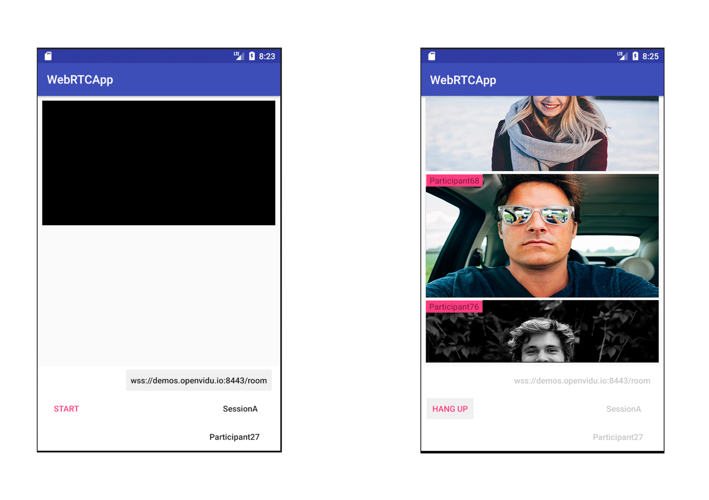
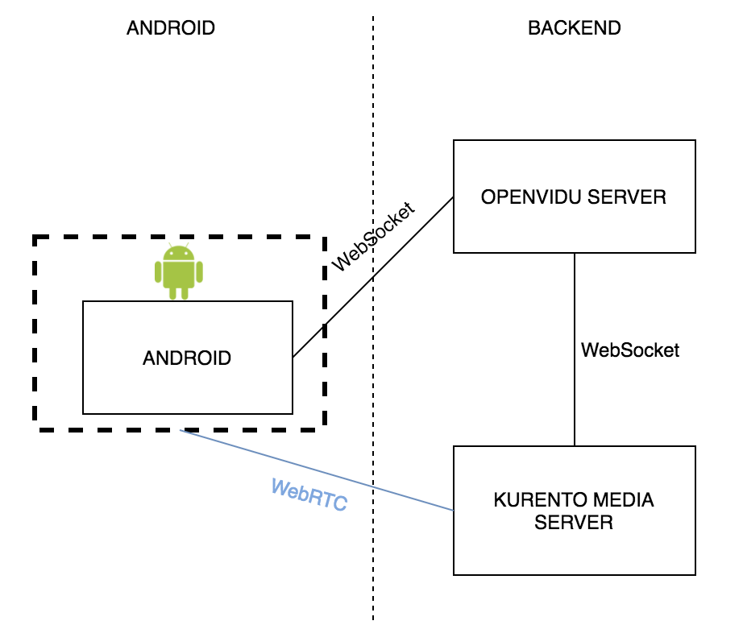

# WebRTCapp

WebRTCapp is a small elaboration that is part of my final degree project. This app aims to be a small video conference app created using mainly WebRTC technology. 
With it, you can make calls though a web socket connection. I already implemented something similar but easier connecting to a webSocket mocked server. You can find the code [here](https://github.com/sergiopaniego/WebRTCAndroidExample) 
 and a brief post explaining the concept [here](https://medium.com/@SergioPaniego/tutorial-on-how-to-make-the-simplest-webrtc-android-app-daacb5c8d133)
 
 ## OpenVidu
The app was built based on connecting to OpenVidu , an open source project that provides 
several libraries implementations to create video conference apps. For more info on whats the project about
I highly recommend you to go and check the following links

- [OpenVidu's Docs](http://openvidu.io/docs/home/)

- [OpenVidu's Project Web](http://openvidu.io/)

- [OpenVidu's GitHub](https://github.com/OpenVidu)



## Libraries in the project

### WebRTC Library
You can find the code for the WebRTC library right on WebRTC's organization [web](https://webrtc.org/native-code/android/). I wrote a briefly post on how WebRTC works internally that you can find 
[here](https://medium.com/@SergioPaniego/how-webrtc-works-internally-b4cf678c7587). 
On WebRTC's web you will find how to compile the binaries and generate the library but that for me wasn't that easy. So I have you solutions for you, this [blog post](https://medium.com/@silvestr1994/webrtc-on-android-part-1-building-b6982aad4b49) that aims to explain how to compile that library.

### ButterKnife Library
This library is really useful to bind views and it really helps us working with views in Android. The view can be injected directly on execution so you can directly use it right when you create the view. 
Link: [ButterKnife](http://jakewharton.github.io/butterknife/)

### WebSocket Library
This library is a WebSocket client designed for Java. It implemented the protocol definition allowing us to use a WebSocket without having to implement the whole RFC.
Link: [WebSocket Library](https://github.com/TakahikoKawasaki/nv-websocket-client)


## How to download the project and run it
If you want to run the project locally on your computer you will need Android Studio with an emulator. You can clone the project using

   ```
   git clone https://github.com/sergiopaniego/WebRTCapp
   ```

opening it on Android Studio importing it and running it with the emulator that comes with it. As I mentioned above, the app is part of a final degree project and for that 
reason the address that comes built in the app points to [https://demos.openvidu.io/basic-videoconference/](https://demos.openvidu.io/basic-videoconference/). This URL hosts an OpenVidu's demo app that you can use to test that 
everything works as expected.

## Development Environment
 How did I developed the app? Tools I used 
 
### Android Studio 3.0.1
 As my main IDE I’ve been using Android Studio 3.0.1, the latest version of the environment developed by Google and JetBrains to build Android apps. 
 This IDE is built on JetBrain’s Intellij IDEA software and comes with all the tools needed to develop Android apps, from the native libraries including Kotlin
  to an emulator [Android Studio's link](https://developer.android.com/studio/index.html).
  
### Android Emulator
To develop the app, I needed an emulator to check that everything was running as expected. I chose a Pixel XL emulator with API 25 to run it. 
The emulator that comes integrated on the IDE is pretty good and there is no need to choose another one for the development I wanted.

### Android device
An emulator is really helpful but a real device is what you really need to check that everything is going well. To help me with this part of the development,
 I used a Samsung Galaxy S6 device so it really helped me finding bugs.

### Sonar
Sonar is a tool that inspects your code to perform an static analysis that gives you a report on how your code health is. I have used it to try to keep my code clean [Sonar Qube's web](https://www.sonarqube.org/)

## App Permissions
The first time you open the app, it will ask you to give some permissions to the app. The permissions and the reason why we need the is the following:
-	Camera: This permission is compulsory because it wouldn’t make any sense to make a video conference app without using the camera, would it?
-	Record Audio: We need this permission to allow you to share your beautiful voice with the crowd on the other side of the conversation.

## Understanding the code

The code is divided in some packages to make the code easier to mantain.
 - CustomWebSocketListener: This class implements WebSocketListener. As its name suggest, this class responsibility is to listen what comes to the socket we have.
 It handles the messages sent by the server
 - PeersManager: Its purpose is to manage the different peers that make a conversation
 - WebSocketTask: The negotiation with the server takes place in this class
 - RemoteParticipant: The participants info goes here
 - VideoConferenceActivity: This is the only Android Activity that the app has. It shows you the menu and the different participants camera (yours too)
 
 The WebSocket Address comes from 
 
 ```
    String sessionName = session_name.getText().toString();
    String participantName = participant_name.getText().toString();
    String socketAddress = socket_address.getText().toString();
```
            
 
 *socket_address* represents the editText field you can fill on the main screen.
 *participant_name* the name you give to the participant and 
 *session_name* the session name. This 3 fields are used to complete the address used to connect to the WebScoket.
 
 ```
    peersManager.setWebSocket(new WebSocketFactory().createSocket(socketAddress));
    peersManager.getWebSocket().connect();
 ```
 
In this part of the code is where the connecting happens, using the address that is built using the fields above. 

Once the connection is established, you need to join a room, what it's make as follows
```
    Map<String, String> joinRoomParams = new HashMap<>();
    joinRoomParams.put("dataChannels", "false");
    joinRoomParams.put(JSONConstants.METADATA, "{\"clientData\": \"" + participantName + "\"}");
    joinRoomParams.put("secret", MY_SECRET);
    joinRoomParams.put("session", baseAddress + sessionName);
    joinRoomParams.put("token", token);
    sendJson(websocket, "joinRoom", joinRoomParams);
```
Using a JSON using RPC 2.0 with joinRoom method and the params that are shown here you can connect to the room
Same process to leave the room, you just have to send 
```
    webSocketAdapter.sendJson(webSocket, "leaveRoom", new HashMap<String, String>());
```
a JSON RPC 2.0 with the method leaveRoom and empty params.
